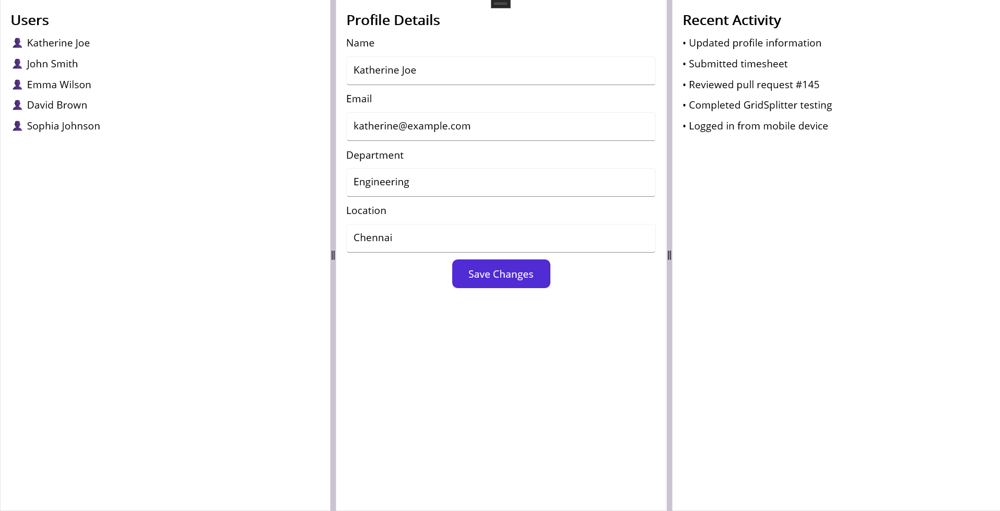

# Getting Started with .NET MAUI Toolkit GridSplitter (SfGridSplitter)

This section provides a quick overview for working with the SfGridSplitter for .NET MAUI. Walk through the entire process of creating a real-world user profile dashboard with resizable panes.

## Creating an application using the .NET MAUI GridSplitter

1. Create a new .NET MAUI application in Visual Studio.
2. Syncfusion .NET MAUI components are available on [nuget.org](https://www.nuget.org/). To add SfGridSplitter to your project, open the NuGet package manager in Visual Studio, search for Syncfusion.Maui.Toolkit and then install it.

## Register the handler

To use this control inside an application, you must register the handler for Syncfusion® core.

```C#

using Microsoft.Extensions.Logging;
using Syncfusion.Maui.Toolkit.Hosting;

namespace GridSplitterGettingStarted
{
    public static class MauiProgram
    {
        public static MauiApp CreateMauiApp()
        {
            var builder = MauiApp.CreateBuilder();

            builder
                .UseMauiApp<App>()
                .ConfigureSyncfusionToolkit()
                .ConfigureFonts(fonts =>
                {
                    fonts.AddFont("OpenSans-Regular.ttf", "OpenSansRegular");
                    fonts.AddFont("OpenSans-Semibold.ttf", "OpenSansSemibold");
                });

#if DEBUG
            builder.Logging.AddDebug();
#endif

            return builder.Build();
        }
    }
}

```

## Add a basic GridSplitter
1. Import the control namespace `Syncfusion.Maui.Toolkit` in XAML.
2. Initialize the `SfGridSplitter` control.

**XAML**
```
<ContentPage
    ...
    xmlns:gridSplitter="clr-namespace:Syncfusion.Maui.Toolkit.GridSplitter;assembly=Syncfusion.Maui.Toolkit">

    <gridSplitter:SfGridSplitter>

        <gridSplitter:SplitterPane>
            <Label Text="Pane 1" />
        </gridSplitter:SplitterPane>

        <gridSplitter:SplitterPane>
            <Label Text="Pane 2" />
        </gridSplitter:SplitterPane>

    </gridSplitter:SfGridSplitter>

</ContentPage>
```

**C#**
```
using Syncfusion.Maui.Toolkit.GridSplitter;

namespace GridSplitterGettingStarted
{
    public partial class MainPage : ContentPage
    {
        public MainPage()
        {
            InitializeComponent();

            SfGridSplitter gridSplitter = new SfGridSplitter();

            SplitterPane pane1 = new SplitterPane
            {
                Content = new Label
                {
                    Text = "Pane 1"
                }
            };

            SplitterPane pane2 = new SplitterPane
            {
                Content = new Label
                {
                    Text = "Pane 2"
                }
            };

            gridSplitter.AddPane(pane1);
            gridSplitter.AddPane(pane2);

            Content = gridSplitter;
        }
    }
}

```

## Create a user profile dashboard using .NET MAUI GridSplitter

The `SplitterPane` collection allows you to organize content into multiple resizable panes. In this example, the `GridSplitter` is used to build a user profile dashboard where users can resize the User List, Profile Details, and Recent Activity sections at runtime.

**XAML**

```
<?xml version="1.0" encoding="utf-8" ?>
<ContentPage 
             ...
             xmlns:gridSplitter="clr-namespace:Syncfusion.Maui.Toolkit.GridSplitter;assembly=Syncfusion.Maui.Toolkit">

    <gridSplitter:SfGridSplitter>

        <!-- User List Pane -->
        <gridSplitter:SplitterPane>
            <VerticalStackLayout Padding="16" Spacing="10">

                <Label Text="Users"
                       FontSize="20"
                       FontAttributes="Bold" />

                <Label Text="👤 Katherine Joe" />
                <Label Text="👤 John Smith" />
                <Label Text="👤 Emma Wilson" />
                <Label Text="👤 David Brown" />
                <Label Text="👤 Sophia Johnson" />

            </VerticalStackLayout>
        </gridSplitter:SplitterPane>

        <!-- Profile Details Pane -->
        <gridSplitter:SplitterPane>
            <VerticalStackLayout Padding="16" Spacing="10">

                <Label Text="Profile Details"
                       FontSize="20"
                       FontAttributes="Bold" />

                <Label Text="Name" />
                <Entry Text="Katherine Joe" />

                <Label Text="Email" />
                <Entry Text="katherine@example.com" />

                <Label Text="Department" />
                <Entry Text="Engineering" />

                <Label Text="Location" />
                <Entry Text="Chennai" />

                <Button Text="Save Changes"
                        WidthRequest="150" />

            </VerticalStackLayout>
        </gridSplitter:SplitterPane>

        <!-- Activity History Pane -->
        <gridSplitter:SplitterPane>
            <VerticalStackLayout Padding="16" Spacing="10">

                <Label Text="Recent Activity"
                       FontSize="20"
                       FontAttributes="Bold" />

                <Label Text="• Updated profile information" />
                <Label Text="• Submitted timesheet" />
                <Label Text="• Reviewed pull request #145" />
                <Label Text="• Completed GridSplitter testing" />
                <Label Text="• Logged in from mobile device" />

            </VerticalStackLayout>
        </gridSplitter:SplitterPane>

    </gridSplitter:SfGridSplitter>

</ContentPage>

```

**C#**

```

using Syncfusion.Maui.Toolkit.GridSplitter;

namespace GridSplitterGettingStarted
{
    public partial class MainPage : ContentPage
    {
        public MainPage()
        {
            InitializeComponent();

            SfGridSplitter gridSplitter = new SfGridSplitter();

            SplitterPane userPane = new SplitterPane
            {
                Content = new VerticalStackLayout
                {
                    Padding = 16,
                    Spacing = 10,
                    Children =
                    {
                        new Label
                        {
                            Text = "Users",
                            FontSize = 20,
                            FontAttributes = FontAttributes.Bold
                        },
                        new Label { Text = "👤 Katherine Joe" },
                        new Label { Text = "👤 John Smith" },
                        new Label { Text = "👤 Emma Wilson" },
                        new Label { Text = "👤 David Brown" },
                        new Label { Text = "👤 Sophia Johnson" }
                    }
                }
            };

            SplitterPane profilePane = new SplitterPane
            {
                Content = new VerticalStackLayout
                {
                    Padding = 16,
                    Spacing = 10,
                    Children =
                    {
                        new Label
                        {
                            Text = "Profile Details",
                            FontSize = 20,
                            FontAttributes = FontAttributes.Bold
                        },

                        new Label
                        {
                            Text = "Name"
                        },
                        new Entry
                        {
                            Text = "Katherine Joe"
                        },

                        new Label
                        {
                            Text = "Email"
                        },
                        new Entry
                        {
                            Text = "katherine@example.com"
                        },

                        new Label
                        {
                            Text = "Department"
                        },
                        new Entry
                        {
                            Text = "Engineering"
                        },

                        new Label
                        {
                            Text = "Location"
                        },
                        new Entry
                        {
                            Text = "Chennai"
                        },

                        new Button
                        {
                            Text = "Save Changes",
                            WidthRequest = 150
                        }
                    }
                }
            };

            SplitterPane activityPane = new SplitterPane
            {
                Content = new VerticalStackLayout
                {
                    Padding = 16,
                    Spacing = 10,
                    Children =
                    {
                        new Label
                        {
                            Text = "Recent Activity",
                            FontSize = 20,
                            FontAttributes = FontAttributes.Bold
                        },

                        new Label
                        {
                            Text = "• Updated profile information"
                        },
                        new Label
                        {
                            Text = "• Submitted timesheet"
                        },
                        new Label
                        {
                            Text = "• Reviewed pull request #145"
                        },
                        new Label
                        {
                            Text = "• Completed GridSplitter testing"
                        },
                        new Label
                        {
                            Text = "• Logged in from mobile device"
                        }
                    }
                }
            };

            gridSplitter.AddPane(userPane);
            gridSplitter.AddPane(profilePane);
            gridSplitter.AddPane(activityPane);

            Content = gridSplitter;
        }
    }
}

```

Run the application to render the following output:



